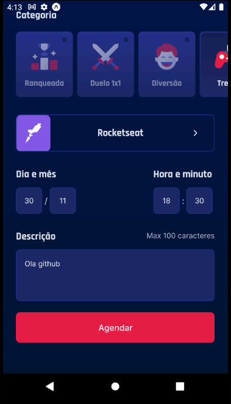

# NLWTG-ReactNative-Gameplay
Projeto desenvolvido durante a semana da Next Level Week Together trilha ReactNative

Consiste em um app para organizar a agenda de jogos com autenticação no Discord

# Tela de SignIn/Home

Apos fazer SignIn ira ser redirecionado a tela "Home"

  

    

# Tela de Agendar

Para criar um novo agendamento é só clicar no "+" no menu

  

# Tela Detalhe

Apos ter algum agendamento basta clicar na partida agendada e sera redirecionado para uma lista com os integrantes do grupo do Discord

